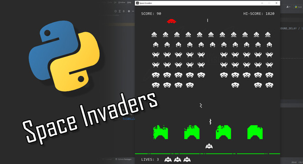

# Space Invaders

See it in action on YouTube - <a href="https://youtu.be/D68G5wjjrwQ">https://youtu.be/D68G5wjjrwQ</a>

## My shot at recreating the first level of the legendary 1978 Space Invaders game.
Space Invaders is a simple shoot 'em up game and does not have complicated game mechanics, 
so one can easily underestimate the effort that has to go into recreating it.
The process consisted of reverse engineering the gameplay from the available gameplay videos only.
Nonetheless, I had to overcome a few hurdles in order to get close to the original game mechanics.

## Moving the alien fleet
Moving the fleet line by line was surprisingly one of the harder parts of the development process.
I tried using pygame.groups, lists and combinations of both. All these solutions have their pros and cons. 
For efficiency reasons, I ended up using a single list and storing row and column data in each alien's instance variables.
That caused other difficulties like detecting when all the rows of aliens touched the side of the screen to change their direction, 
or keeping track of number of alien columns to recalculate alien movement speed.

## Making destructible walls
Another tricky task was creating walls from separate "pixel" objects, to allow for their destruction.
All the wall blocks have to be placed in their exact locations to form the correct wall shapes.
In the original game, the wall "pixels" are removed on the exact location of pixels of the explosion "sprite".
That would be hard to do using sprites as we have no way to keep track of separate sprite pixels' location.
I solved the wall destruction by removing random wall "pixels" around the position of shot explosion.
I guess the solution closer to the original would be not using sprites at all, but
defining explosions as separate list of pixels instead. 
All pixels would be displayed in their hard-coded positions around the shot when hitting another pygame.Surface.

The bottom HUD line is destructible as well. 
In the original game, multiple hits are necessary to destroy one block of the line.
I reduced this to one hit only, as I wanted to make this effect bit more pronounced.

## Sounds
When alien boss(the UFO) appears, 
it keeps playing its sound repeatedly in a loop until it is destroyed or moves out of the screen.
When simply playing the sound repeatedly in a loop with pygame.mixer.Sound module, there is always a very short, 
but noticeable pause before playing it again.
As the original Space Invaders does not have any background music, 
the simplest workaround is to use Pygame mixer's music module and playing the sound as music with loops parameter set to -1 (playing infinitely).
For player shots I dealt with this problem by editing the shot sound to make it a bit longer and playing it just once.

I found all the original sounds on <a href="https://www.classicgaming.cc/classics/space-invaders/sounds">classicgaming.cc</a>.

## Sprites
I created all the sprites myself, mostly using the original gameplay videos on YouTube as a reference.
The player spaceship differs from the original as I preferred this design over the original simpler one.