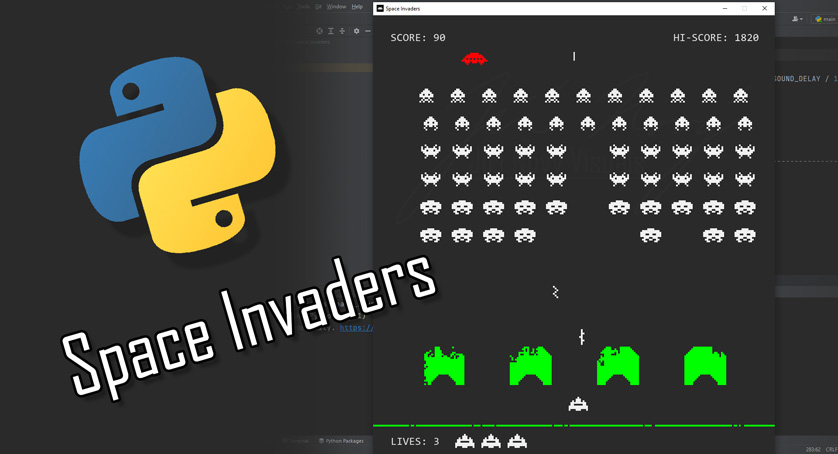

# Space Invaders

See it in action on YouTube - <a href="https://youtu.be/D68G5wjjrwQ">https://youtu.be/D68G5wjjrwQ</a>

## My shot at recreating the first level of the legendary 1978 Space Invaders game.
Space Invaders is a simple looking game and does not have complicated game mechanics, so one can easily underestimate the effort that has to go into recreating it.
Nonetheless, there are a few hurdles one has to overcome in order to get closer to the original game mechanics.

## Moving the alien fleet
Moving the fleet line by line was surprisingly one of the harder parts of the development process.
I tried using pygame.groups, lists and combinations of both. All these solutions have their pros and cons. 
I ended up using a single list and storing row and column data in each alien's instance variables.
That caused other difficulties like detecting when all the rows of aliens touched the side of the screen to changing their direction, or keeping track of number of alien columns to recalculate alien movement speed.

## Making destructible walls
Another challenging task was creating walls from separate "pixel" objects, to allow for their destruction.
All the wall blocks have to be placed in their exact locations to form the correct wall shapes.
In the original game, the wall "pixels" are removed on the exact location of pixels of explosion "sprite".
That would be hard to do using sprites as we have no control over separate sprite pixels location.
I solved the wall destruction by removing random wall "pixels" around the shot explosion.

The bottom HUD line is destructible as well. In the original game, multiple hits are necessary to destroy one block of the line.
I reduced this to one hit only, as I wanted to make this effect bit more pronounced.
